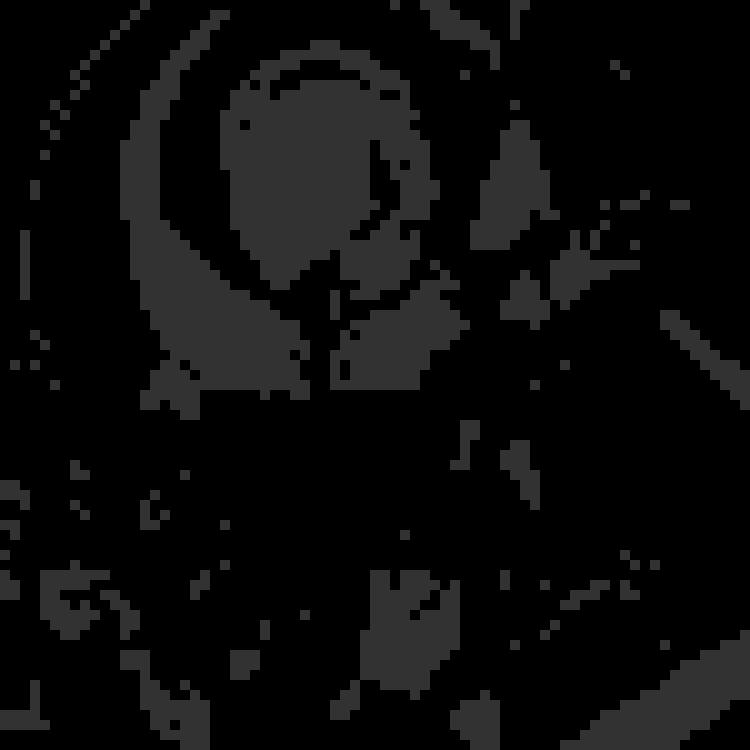

# Рефакторинг

В последнее время очень популярен [пиксельарт](https://en.wikipedia.org/wiki/Pixel_art), а также разнообразные наборы для ручного крафта.

Один из проектов, [mozabrick](https://mozabrick.ru/products/model-l/), например, предлагает что-то типа мозайки из квадратиков 5 градаций серого, из которой можно собрать любую фотографию.


С помощью приложения вы накладываете фильтр, получаете черно-белый пиксель-арт, который можно набрать уже мозаикой.

Иногда делают такие панно прямо на зданиях.


Вот я прогнал через фильтр свое фото:


Вот так примерно выглядит процесс сборки панно:


Естественно, появилось желание написать вручную такой фильтр. Он может понадобится для пиксель-арта, создания игр с анимацией а-ля ранний Mortal Kombat, японских кроссвордов или для вязки свитеров ближе к НГ. Для чтения-записи изображений используется библиотека `pillow`, для всех остальных манипуляций &mdash; `numpy`.


```python
from PIL import Image
import numpy as np
img = Image.open("img2.jpg")
arr = np.array(img)
a = len(arr)
a1 = len(arr[1])
i = 0
while i < a - 11:
    j = 0
    while j < a1 - 11:
        s = 0
        for n in range(i, i + 10):
            for n1 in range(j, j + 10):
                n1 = arr[n][n1][0]
                n2 = arr[n][n1][1]
                n3 = arr[n][n1][2]
                M = n1 + n2 + n3
                s += M
        s = int(s // 100)
        for n in range(i, i + 10):
            for n1 in range(j, j + 10):
                arr[n][n1][0] = int(s // 50) * 50
                arr[n][n1][1] = int(s // 50) * 50
                arr[n][n1][2] = int(s // 50) * 50
        j = j + 10
    i = i + 10
res = Image.fromarray(arr)
res.save('res.jpg')
```

Картинка прелставляет сосбой трехмерный массив, где два измерения &mdash; таблица с пикселями, а пиксель &mdash; что-то то типа массива `[12, 240, 123]`, содержащего компоненты RGB.  

Я ввел размер элемента мозайки 10x10 пикселей. Среди 100 пикселей из большой ячейки я просто выясняю среднюю яркость и закрашиваю их все в один цвет средней яркости, приведенный к ступеньке с шагом 50.

В результате из такой картинки:


Получается такая:



Это не тот результат, на который я рассчитывал, и вам предстоит много поработать с моим кодом.

Представьте этапы как отдельные коммиты.

## Что делать?

### 1 этап
К коду настолько много вопросов, что я даже не знаю с чего начать...

* В коде содержатся как минимум четыре ошибки, которые заставляют фильтр работать не так, как нужно.
    * Одна из них очень нетипична для программиста на Питоне и связана с переполнением беззнакового целого `numpy.uint8`.
    * В одном месте я запутался с именами переменных.
    * Неверно считаю компоненты серого цвета (забываю поделить на 3).
    * Неверно работаю с граничными условиями, в результате чего справа и внизу остались необработанные полосы по 10 пикселей.

### 2 этап
* PEP8.
* Именование переменных.
* Возможность управлять размерами мозайки (сейчас &mdash; только 10x10).
* Возможность управлять градациями серого (сейчас &mdash; с шагом 50). Лучше сделать просто в виде задания количества шагов. Например: 4 градации, 6 градаций. 
* Выделение функций.
### 3 этап
* По возможности убрать ручные циклы, заменив их матричными преобразованиями.
### 4 этап
* Возможно, переписать в консольную утилиту, которой на вход подаются имена исходного изображения и результата. Сейчас чтобы заставить код работать с другой картинкой, его надо исправлять.
